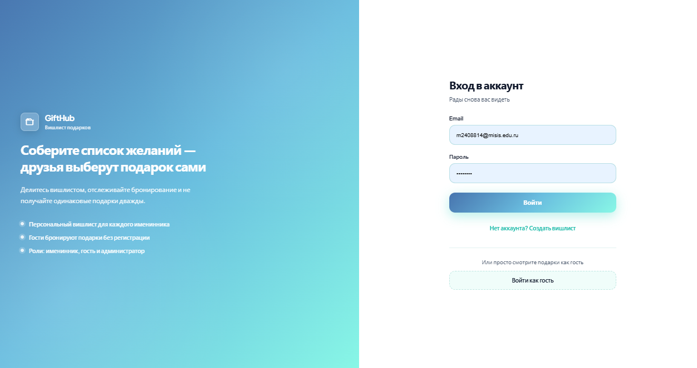
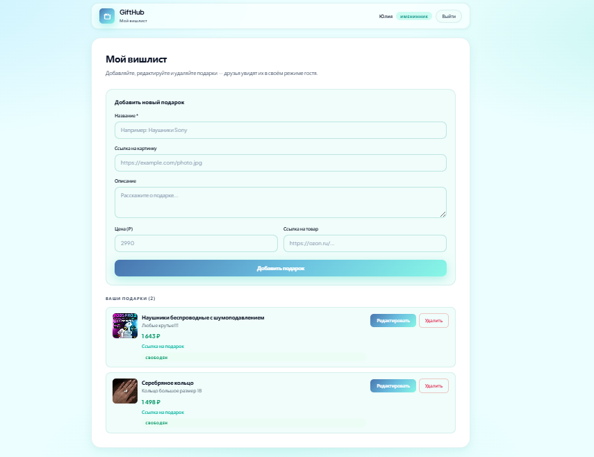
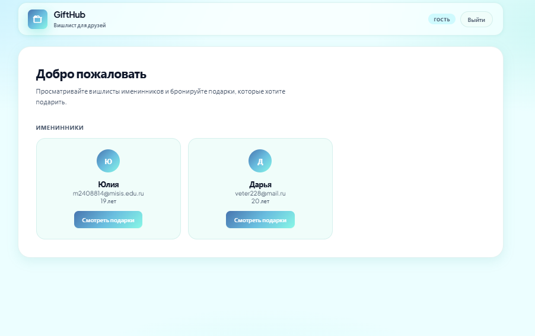
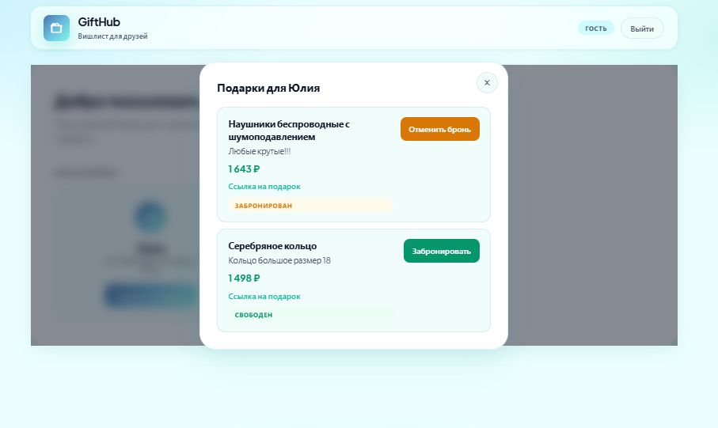
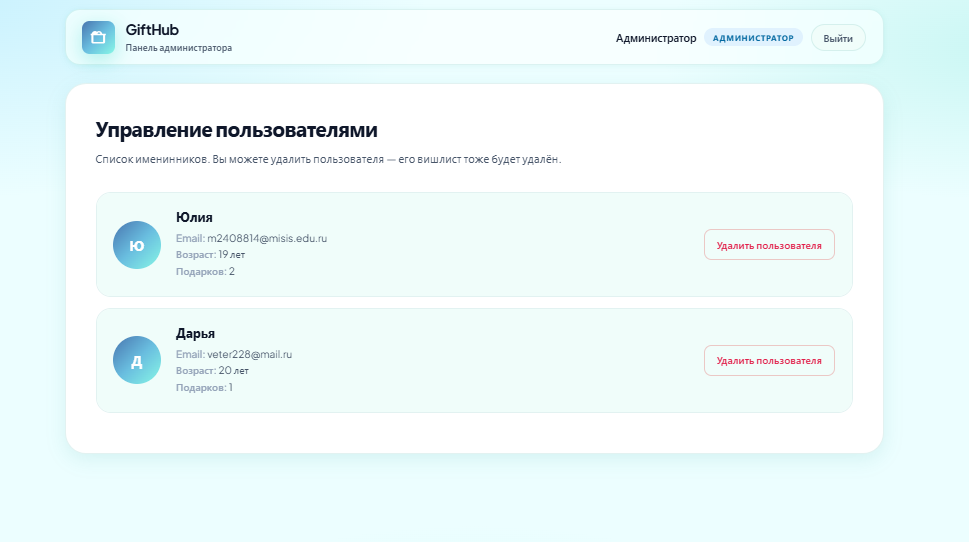

# GiftHub — вишлист подарков

Веб-приложение для создания списков желаний и бронирования подарков друзьями. Именинник ведёт свой вишлист, гости просматривают чужие списки и резервируют подарки без регистрации, администратор управляет пользователями.
Создано в рамках курсовой работы по предмету "Клиент-серверные приложения, сети и системы"

## Скриншоты

### Вход и регистрация


### Вишлист именинника


### Режим гостя




### Панель администратора


## Возможности

- **Именинник** — регистрация, вход, CRUD подарков в своём вишлисте (название, фото, описание, цена, ссылка).
- **Гость** — просмотр вишлистов без пароля, бронь и отмена брони подарка.
- **Администратор** — просмотр всех пользователей, удаление аккаунта вместе с вишлистом.
- Сессии с токеном (`X-Session-Token`), восстановление входа через `localStorage`.
- Валидация данных на сервере (email, поля подарка).

## Стек

| Часть | Технологии |
|-------|------------|
| Frontend | React 19, Create React App |
| Backend | Node.js, Express 5 |
| Хранение | In-memory (данные сбрасываются при перезапуске сервера) |
| Безопасность | bcrypt (пароли), сессии в памяти |

## Быстрый старт

### Требования

- Node.js 18+

### 1. Backend

```bash
cd backend
npm install
node server.js
```

API: `http://localhost:3001`

### 2. Frontend

```bash
cd frontend
npm install
npm start
```

Приложение: `http://localhost:3000`

## Тестовые аккаунты

| Роль | Email | Пароль |
|------|-------|--------|
| Именинник (Юлия) | `m2408814@misis.edu.ru` | `julia123` |
| Именинник (Дарья) | `veter228@mail.ru` | `dasha123` |
| Администратор | `admin@gifthub.com` | `admin123` |

Гостевой режим — кнопка **«Войти как гость»** на экране авторизации.

## Структура проекта

```
├── backend/
│   ├── server.js              # Точка входа Express
│   ├── routes/                # auth, users, gifts
│   ├── controllers/           # usersController
│   ├── services/              # auth, user, gift
│   ├── middleware/            # auth, validation
│   ├── data/memoryDb.js       # Демо-данные в памяти
│   └── utils/seedPasswords.js
├── frontend/
│   ├── src/
│   │   ├── App.js             # Роутинг по ролям, auth, UI
│   │   ├── components/        # UserWishlist, AddGiftForm, GiftDetails, Avatar
│   │   └── services/api.js    # HTTP-клиент к API
│   └── public/
└── SERVER_ARCHITECTURE.md     # Диаграмма архитектуры backend
```

## API (кратко)

| Метод | Путь | Описание |
|-------|------|----------|
| POST | `/auth/login`, `/auth/register` | Вход и регистрация |
| POST | `/auth/logout` | Выход |
| GET | `/auth/verify` | Проверка сессии |
| GET | `/users` | Список именинников |
| GET | `/users/:id/gifts` | Подарки пользователя |
| POST/PUT/DELETE | `/users/:userId/gifts/...` | Управление подарками (владелец) |
| DELETE | `/users/:id` | Удаление пользователя (админ) |
| POST/DELETE | `/gifts/:giftId/reserve` | Бронь / отмена (гость, заголовок `X-Guest-Id`) |

## localStorage (клиент)

| Ключ | Назначение |
|------|------------|
| `sessionToken` | Токен сессии после входа |
| `user` | JSON текущего пользователя (`id`, `name`, `role`) |
| `guestId` | Идентификатор гостя для бронирования |
